# MANIT-Student-Portal
A website whose purpose was to give a
platform, namely “MANIT Student Portal”, to students of our college
for Posting their Doubts, Searching Course Books for particular
subjects and Viewing Time Table. Technologies involved were HTML, CSS, Basic Bootstrap, Php, MySQL.  

http://www.manitstudentportal.rf.gd

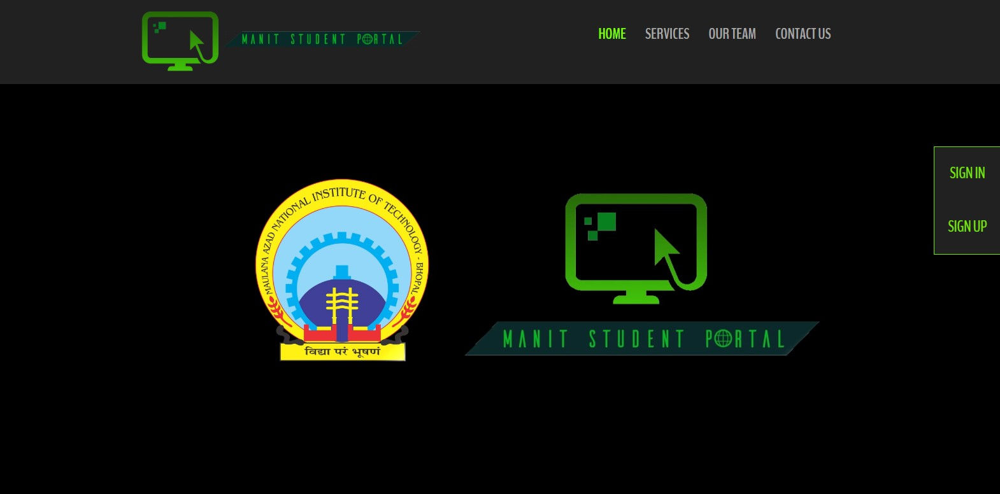
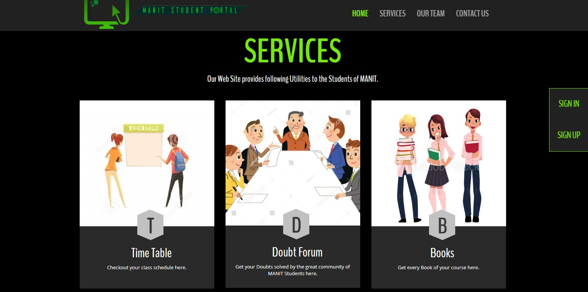
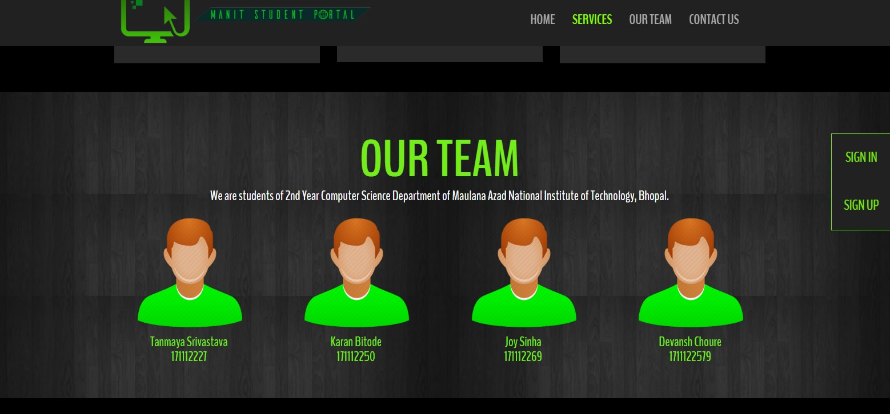
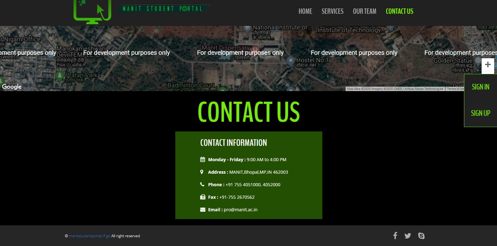
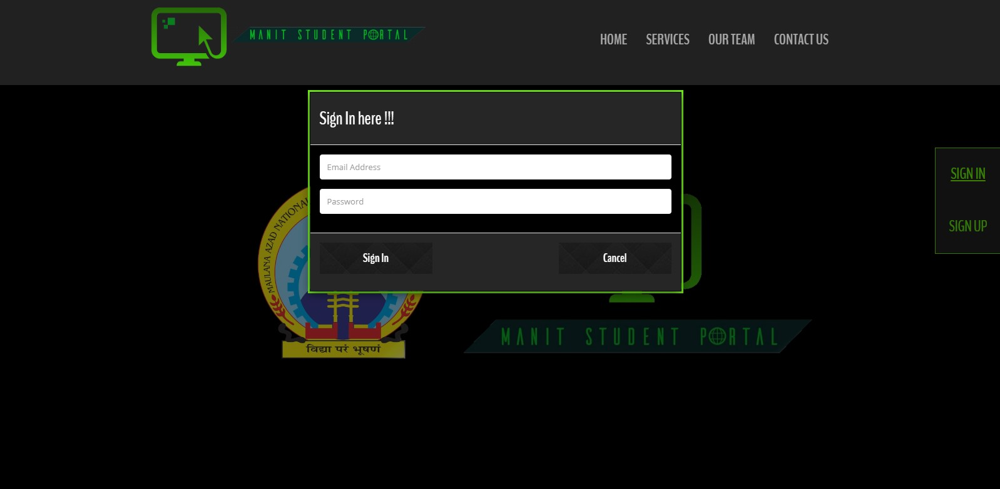
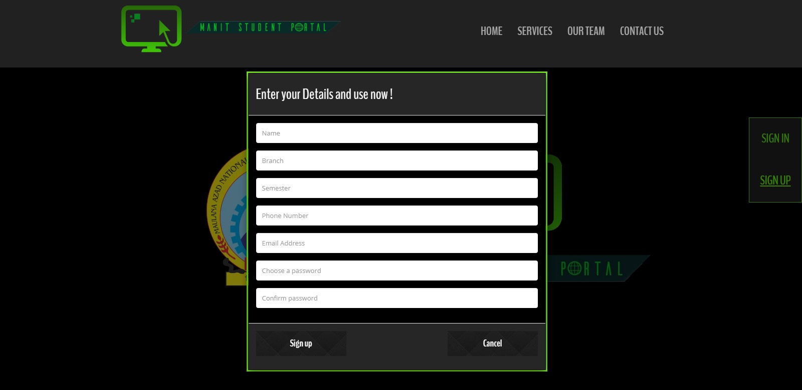

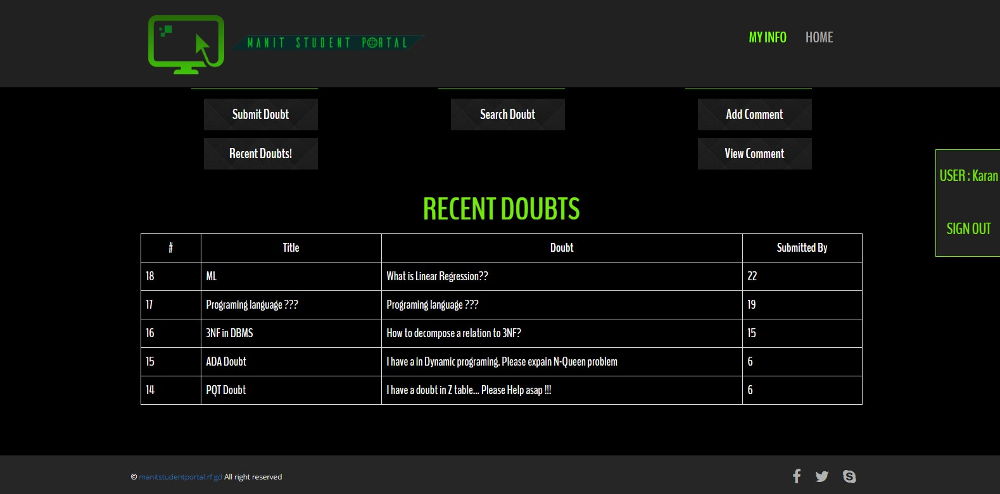
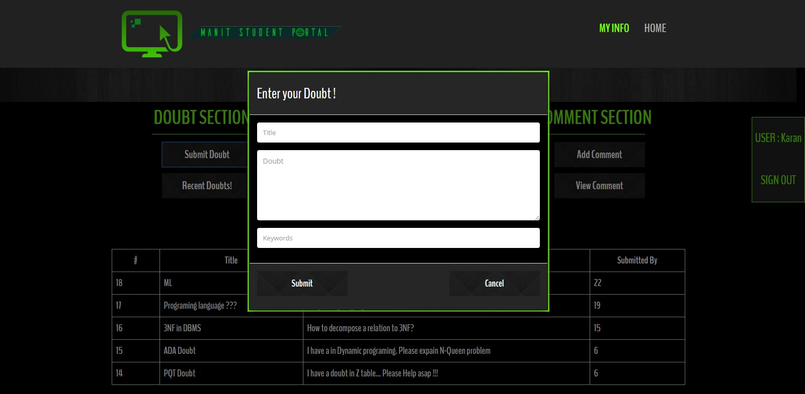
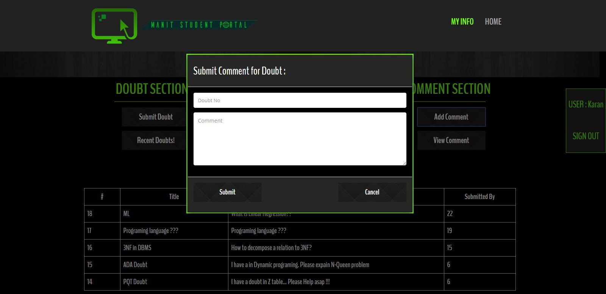
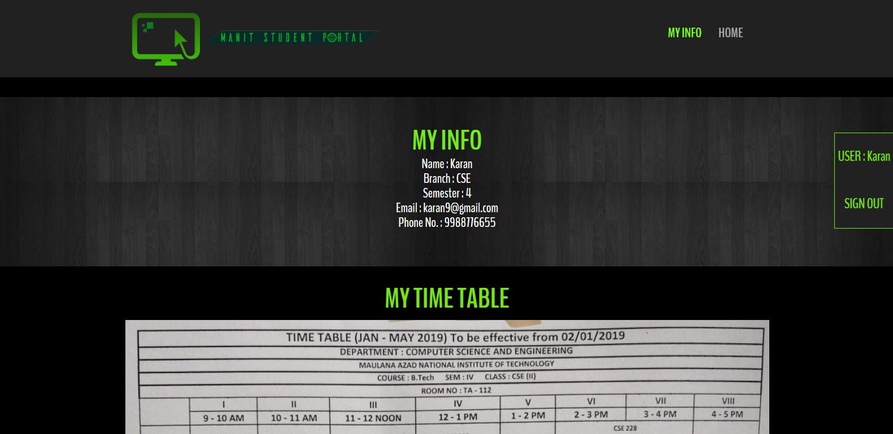

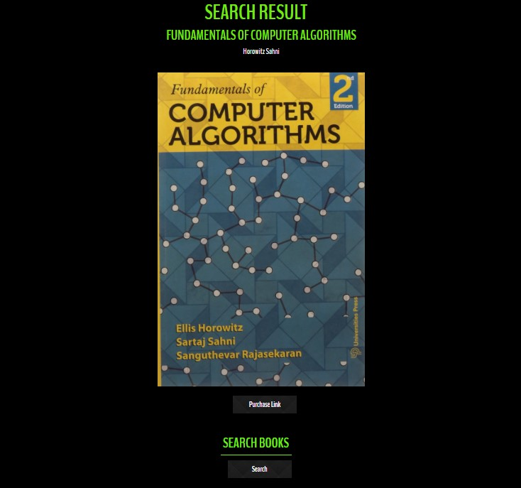
